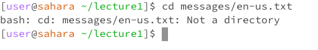
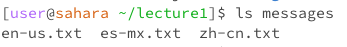
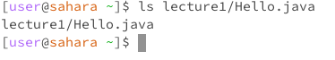
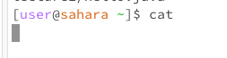

## Lab1 Report

### ```cd```
#### - Example 1 (no arugments): ```cd``` --> 
##### - it will show nothing because cd will bring you back to the home /home
#### - Example 2: ```d lecture1``` -->  
##### - it will show that that dir changes to lecture1 since we move to this working dir with cd
#### - Example 3: ```cd lecture1/messages/en-us.txt``` --> 
##### - The cd command is used to change the current directory, and it only works with directories, not files. If en-us.txt is a file, the command will result in an error, 

### ```ls```
#### - Example 1 (no arugments): ```ls``` --> 
##### - It shows all the files and dir within the current working dir
#### - Example 2: ```ls lecture1``` -->  
##### - It shows that we go into this dir and show all the files and dir within this dir or files but we are not changing our current working dir
#### - Example 3: ```ls lecture1/Hello.java``` --> 
##### - It shows the path I provided to the file because it confirms the existence of the file by listing the path provided.


### ```cat```
#### - Example 1 (no arugments): ```cat``` --> 
##### - The reason it's outputting nothing because it's waiting for user to enter inputs
#### - Example 2: ```cat lecture1``` --> 
##### - The reason it's outptting this because cat is used to read and concatenate files not dir
#### - Example 3: ```cat lecture1/Hello.java``` --> 
```
  import java.io.IOException;
  import java.nio.charset.StandardCharsets;
  import java.nio.file.Files;
  import java.nio.file.Path;
  
  public class Hello {
    public static void main(String[] args) throws IOException {
      String content = Files.readString(Path.of(args[0]), StandardCharsets.UTF_8);    
      System.out.println(content);
    }
  }
```
##### - The reason it's ouptting this because it's reading the entire files and concatenated and output in the terminal


